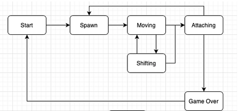
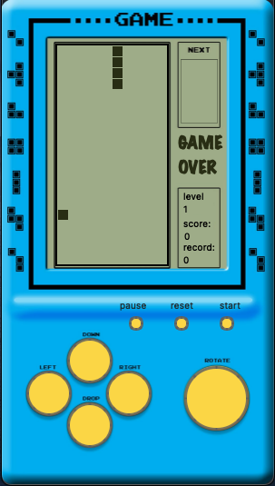

# BrickGames

## Описание
Настольная версия знаменитой консоли 90-х.
На данный момент проект включает в себя игры Tetris и Snake в консольной и десктопной реализациях. В работе проверено на Mac Air M2 OS Sonoma 14.6.1

## Конечные автоматы
- Для организации построения логики игры использован конечный автомат

## Установка
- Сборка осуществляется с помощью Makefile
- Просто наберите make в терминале в каталоге src
- Приложения для запуска будут находиться в каталоге bin проекта

## BrickGame Desktop

### Технологии
- Разработан на языке C++ стандарта С17
- Графический интерфейс реализован спомощью Qt5  и программы  Qt Creator
- Сборка осуществляется qmake
- При
### Управление
- Управление осуществляется как с помощью устройства ввода в виде клавиатуры, так и виртуальными кнопками в окне игры
- Клавиши со стрелками отвечают за соответствующее направление
- Пробел отвечает за какое либо действие
- Start - начало и выбор игры (('S' на Клавиатуре ))
- Reset - сброс текущей игры ('R' на Клавиатуре )
- Pause - пауза ('P' на Клавиатуре )
- Для выхода из игры просто закройте окно

## Snake Gameplay
- Цель игры поймать появляющуюся в размых местах мышку
- Голова в погоне за целью должна избегать границ поля и самого тела змейки
- Игра включает в себя 10 уровней
- Каждый уровень скорость змейки возрастает
- За каждую пойманную мышку игрок получает одно очно
- Каждые 5 очков уровень возрастает
- Максимальное количество очков 196

## BrickGame Console
### Технологии
- Tetris разработан на языке C стандарта С11  Snake С++ С17
- Для графического интерфейса использована библиотека Ncurses
### Управление
- Управление с возможно только с клавиатуры